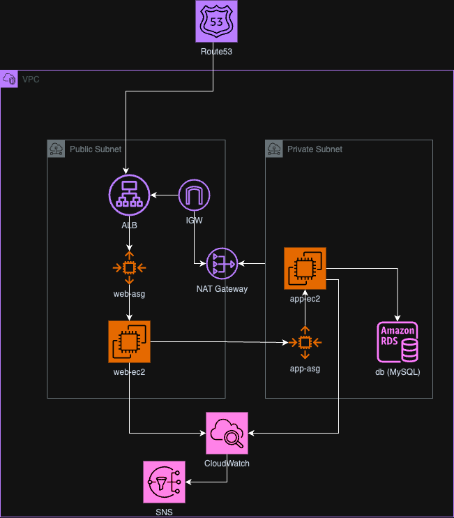

# Three-Tier Application Infrastructure on AWS

This project provisions a secure and scalable three-tier architecture on AWS using Terraform. The architecture includes:

Web Tier: Hosted in a public subnet with an Application Load Balancer (ALB) and an auto-scaling group of EC2 instances. Managed by Route 53 for DNS routing.
Application Tier: Hosted in a private subnet, with an auto-scaling group of EC2 instances that handle application logic. Instances access the internet via a NAT Gateway.
Data Tier: Hosted in a private subnet with Amazon RDS (MySQL) for database storage, accessible only by the application tier.
Key Components
VPC: Configured with public and private subnets across availability zones.
Internet Gateway (IGW): Allows public subnet resources to access the internet.
NAT Gateway: Provides outbound internet access for private subnet resources.
Route Tables: Configured for internet and NAT routing for public and private subnets respectively.
CloudWatch & SNS: For monitoring and alerts.

# Architecture diagram

